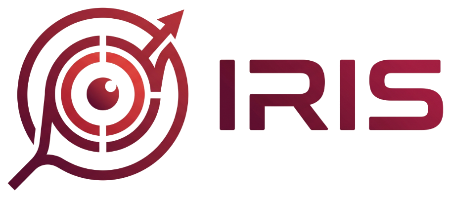

<p align="center">
  
</p>

<h1 align="center">Iris (v1) — Flight Recorder for CPython via PEP 669 & MCP</h1>

<p align="center">
  <a href="https://www.python.org/downloads/"></a>
  <a href="https://opensource.org/licenses/MIT"></a>
  <a href="https://modelcontextprotocol.io/"></a>
  <a href="https://peps.python.org/pep-0669/"></a>
  <a href="tests/"></a>
</p>

> **Iris is a flight recorder for Python code.**  
> Instead of traditional debuggers that cause **stop-the-world freezes** while an LLM is thinking, Iris lets code run naturally at native speed. It records call trees, line executions, branch decisions, and variable mutations without pausing, exposing empirical execution data to AI coding agents (**Google Antigravity, Claude Code, Cursor**) via the **Model Context Protocol (MCP)**.

---

## 📌 Table of Contents
1. [The Problem Iris Solves](#-the-problem-iris-solves)
2. [Antigravity Integration (100% Guaranteed Discovery)](#-antigravity-integration-100-guaranteed-discovery)
3. [System Architecture](#-system-architecture)
4. [Key Features](#-key-features)
5. [Core MCP Tools (API Reference)](#-core-mcp-tools-api-reference)
6. [User Guide & Workflows](#-user-guide--workflows)
7. [Security & Safety (Circuit Breaker)](#-security--safety-circuit-breaker)
8. [Testing & Development](#-testing--development)
9. [License](#-license)

---

## 💡 The Problem Iris Solves

When an AI Agent reads static code, it only sees **possibilities** (*"function A might call function B"*). It cannot see **runtime reality** (*"during that specific run, function A called function B three times, returning empty on the third attempt"*).

| Scenario | Agent Reading Static Code | Runtime Truth Exposed by Iris |
|---|---|---|
| **Function called 3 times** | *"Must be an infinite loop bug"* | Intentional timeout retry mechanism |
| **Complex `if` branch** | *"The bug is probably inside this branch"* | Condition evaluated to `False`; block **never executed** |
| **Unexpectedly empty variable** | *"External API must have returned empty data"* | An upstream regex middleware stripped all characters |

Iris does not deduce or speculate for the Agent — it provides **empirical evidence**, allowing the Agent to find the root cause with certainty.

---

## 🚀 Antigravity Integration (100% Guaranteed Discovery)

Iris is engineered specifically for **Google Antigravity IDE** to automatically discover and ingest the MCP server upon installation. You can use any of the following 3 setups:

### Method 1: Direct Clone (Zero-Config)
The repository includes `.agents/plugins/iris/` and `.agents/mcp_config.json` pre-configured:
```powershell
git clone https://github.com/your-org/iris.git
cd iris
pip install -e .
```
👉 Simply open the `iris` workspace in Antigravity. The agent will **automatically detect the `iris` MCP server** and its 4 tools immediately.

---

### Method 2: Setup in Any Existing Project (1-Click Local Setup)
If you are developing your own project (FastAPI, Django, Flask, CLI):
```powershell
# 1. Install Iris
pip install iris-flight-recorder

# 2. Configure Antigravity in your project directory
iris setup-agent
```
This automatically initializes `.agents/plugins/iris/` and maps the exact Python interpreter for Antigravity.

---

### Method 3: Global Registration (All Workspaces)
To make Iris available across **every project** you open on your machine:
```powershell
iris setup-agent --global
```
This automatically registers Iris in Antigravity's global configuration (`~/.gemini/config/mcp_config.json`). Any workspace opened in Antigravity will have instant access to Iris tools.

---

## 🏗️ System Architecture

```text
┌─────────────────────────────────────────────────────────────┐
│                 AI Coding Agent (Antigravity)               │
└──────────────────────────────┬──────────────────────────────┘
                               │ MCP (JSON-RPC over stdio)
                               ▼
┌─────────────────────────────────────────────────────────────┐
│                       Iris MCP Server                       │
│    (Independent process, does NOT run inside target app)    │
└──────────────────────────────┬──────────────────────────────┘
                               │ SQL Read (WAL Mode)
                               ▼
┌─────────────────────────────────────────────────────────────┐
│                 iris_trace.db (SQLite WAL)                  │
└──────────────────────────────▲──────────────────────────────┘
                               │ SQL Batch Insert (Background Thread)
┌──────────────────────────────┴──────────────────────────────┐
│                Event Queue (queue.SimpleQueue)              │
└──────────────────────────────▲──────────────────────────────┘
                               │ In-Memory Non-blocking Push
┌──────────────────────────────┴──────────────────────────────┐
│            Target Application Process (Python >= 3.12)      │
│  ┌───────────────────────────────────────────────────────┐  │
│  │ Iris Observer (PEP 669 sys.monitoring)               │  │
│  │ Only wakes up when the armed entrypoint is executed  │  │
│  └───────────────────────────────────────────────────────┘  │
└─────────────────────────────────────────────────────────────┘
```

**Key Principle:** The Iris Observer runs **inside** the target application process as a lightweight library, while the Iris MCP Server runs as a **separate process** reading SQLite in WAL mode. The application process is never frozen while an AI agent is thinking or reading traces.

---

## ✨ Key Features

1. **Zero Stop-the-World Overhead**: Built on CPython's PEP 669 (`sys.monitoring`). While sleeping (`UNARMED`), overhead is strictly zero. While `ARMED`, it only checks function identity at `PY_START`.
2. **Automatic Pytest Plugin (`pytest-iris`)**: When an Agent arms an entrypoint, you just run `pytest`. Iris automatically attaches, traces, and flushes **without modifying a single line of test code**.
3. **Variable Delta (Diff) Tracking**: Each line event computes and isolates **only variables that actually changed** (`delta`), saving >80% context tokens for the LLM.
4. **Full Asyncio Context**: Preserves coroutine parent-child hierarchies and automatically captures `async_task_id` via `contextvars` and `asyncio.current_task()`.
5. **Multi-layer Data Sanitizer**: Masks sensitive variables (`password`, `token`, `secret`, `api_key`, `credit_card`, `ssn`) and scans values with regex for JWT, AWS keys, and private key PEMs before writing to disk.
6. **Circuit Breakers**: Auto-aborts tracing if a session exceeds **500,000 events** or database size reaches **200 MB**, preventing disk bloat during runaway loops.
7. **Auto-Timeout**: Automatically transitions stale sessions to `ABORTED_TIMEOUT` if the target function is not invoked within the timeout window.

---

## 🛠️ Core MCP Tools (API Reference)

When connected to Antigravity, the Agent has access to the following 4 tools:

### 1. `iris_arm_entry`
Arm an entry point (file and function) for observation.
- **Parameters:**
  - `entry_file` *(string, required)*: Path or filename of the target script (e.g., `"routes.py"`, `"services/order.py"`).
  - `entry_function` *(string, required)*: Name of the target function (e.g., `"handle_chat"`).
  - `timeout_seconds` *(int, default: 60)*: Maximum duration in seconds to wait for execution.
- **Returns:** `session_id`, state (`ARMED`), database path.

### 2. `iris_get_session_status`
Check the status and summary statistics of an observation session.
- **Parameters:**
  - `session_id` *(string, required)*: Session ID returned by `iris_arm_entry`.
- **Returns:** `state` (`ARMED`, `TRACING`, `COMPLETED`, `ABORTED_TIMEOUT`, `COMPLETED_TRUNCATED`), `total_events`, start/end timestamps.

### 3. `iris_query_call_tree`
Query the hierarchical call tree of functions invoked during the session.
- **Parameters:**
  - `session_id` *(string, required)*: Session ID.
  - `depth_limit` *(int, default: 2)*: Maximum call depth to return.
- **Returns:** JSON hierarchy including `function_name`, `file_path`, `execution_id`, and nested `children`.

### 4. `iris_inspect_execution_flow`
Inspect detailed line-by-line execution, source code, and variable mutations.
- **Parameters:**
  - `execution_id` *(string, required)*: Specific function execution ID from the call tree.
  - `limit` *(int, default: 50)*: Number of events per page.
  - `cursor` *(int, default: 0)*: Sequence number offset for pagination.
- **Returns:** Ordered event stream (`LINE`, `BRANCH`, `RETURN`, `EXCEPTION`), resolved `source_line`, and `payload.delta`.

---

## 📖 User Guide & Workflows

### Scenario 1: Debugging with Pytest (Recommended for AI Agents)
1. **Agent arms target function via MCP**:
   ```json
   iris_arm_entry(entry_file="routes.py", entry_function="handle_chat")
   ```
2. **Run your tests**:
   ```powershell
   pytest tests/test_chat.py
   ```
   *Iris automatically detects the ARMED session and traces execution during the test.*
3. **Agent queries the flight recorder**:
   ```json
   iris_get_session_status(session_id="iris_...")
   iris_query_call_tree(session_id="iris_...")
   iris_inspect_execution_flow(execution_id="exec_...")
   ```

---

### Scenario 2: Running Standalone Scripts via CLI
```powershell
# Execute any script under Iris flight recording
python -m iris run app/main.py
```

---

### Scenario 3: Programmatic Tracing in Python Code
```python
from iris import trace, trace_context

# Option A: Context Manager
with trace_context(entry_file="my_service.py", entry_function="process_order"):
    process_order(order_id=123)

# Option B: Function Decorator
@trace(entry_function="my_api")
def my_api():
    ...
```

---

### Database Maintenance & Pruning
```powershell
# View environment diagnostics and PEP 669 status
python -m iris info

# Retain latest 5 sessions and prune older trace history
python -m iris clean --keep 5

# Reset and purge all trace sessions
python -m iris clean --all
```

---

## 🔒 Security & Safety (Circuit Breaker)

- **100% Offline & Local**: All trace data is stored locally in SQLite (`iris_trace.db`). No cloud telemetry or network requests are ever made.
- **Automatic In-Memory Secret Redaction**:
  - Variable names matching `password`, `secret`, `token`, `api_key`, `auth`, `credit_card`, `private_key`, `ssn` are redacted as `[REDACTED_SECRET: len=...]`.
  - Regex pattern matchers sanitize JWTs, AWS credentials, RSA/SSH private keys, and credit cards.
  - Large values (strings > 256 characters, collections > 20 items) are safely truncated before reaching storage.
- **Circuit Breakers**: Prevents runaway recursive loops from filling disk space by halting capture at **500,000 events** or **200 MB** database size.

---

## 🧪 Testing & Development

Run the complete automated test suite (11/11 tests passing):
```powershell
python -m pytest tests/
```

Test suite coverage:
- `test_mcp_handshake.py`: Stdio JSON-RPC protocol compliance and MCP capabilities.
- `test_sanitizer.py`: DataSanitizer blacklist, regex, and truncation rules.
- `test_fsm_observer.py`: FSM state transitions, PEP 669 line/branch/return events, nested functions, and asyncio tasks.
- `test_e2e_demo.py`: Complete 6-step flight recording scenario identifying subtle regex bugs.
- `test_v1_enhancements.py`: Auto-timeout expiry, variable delta isolation, async task ID capture, and database pruning.

---

## 📄 License

This project is licensed under the [MIT License](LICENSE).  
Feel free to use, modify, and distribute in both personal and commercial projects.
